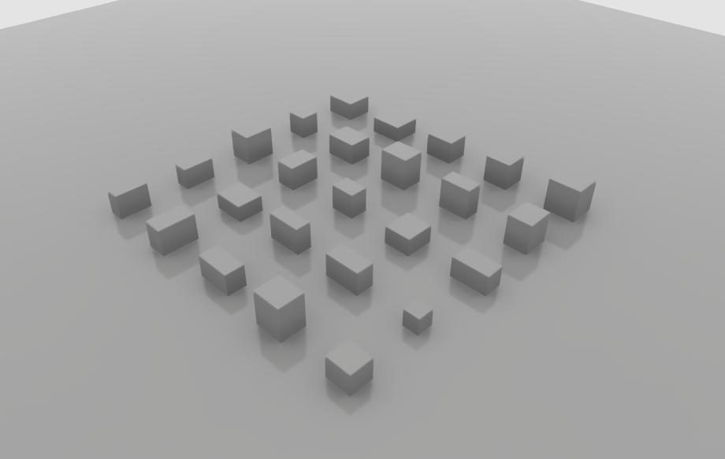

# USD Scene Construction Utilities

USD Scene Construction Utilities is an open-source collection of utilities
built on top of the USD Python API that makes it easy for beginners to create 
and modify USD scenes.


If you find that USD Scene Construction Utilities is too limited for your use case, you may find still 
find the open-source code a useful reference for working with the USD 
Python API.

> Please note, USD Scene Construction Utilities **is not** a comprehensive USD Python API wrapper.  That
> said, it may help you with your project, or you might find the open-source code helpful
> as a reference for learning USD.  See the full [disclaimer](#disclaimer) 
> below for more information.  If run into any issues or have any questions please [let us know](../..//issues)!

## Usage

USD Scene Construction Utilities exposes a variety of utility functions that operating on the USD stage
like this:

```python
from usd_scene_construction_utils import (
    new_in_memory_stage, add_plane, add_box, stack, export_stage
)

stage = new_in_memory_stage()

floor = add_plane(stage, "/scene/floor", size=(500, 500))
box = add_box(stage, "/scene/box", size=(100, 100, 100))

stack_prims([floor, box], axis=2)

export_stage(stage, "hello_box.usda", default_prim="/scene")
```

If you don't want to use the higher level functions, you can read the [usd_scene_construction_utils.py](usd_scene_construction_utils.py)
file to learn some ways to use the USD Python API directly.

After building a scene with USD Scene Construction Utilities, we recommend using Omniverse Replicator
for generating synthetic data, while performing additional randomizations that
retain the structure of the scene, like camera position, lighting, and materials.
To get started, you may find the [using replicator with a fully developed scene](https://docs.omniverse.nvidia.com/prod_extensions/prod_extensions/ext_replicator/apis_with_fully_developed_scene.html)
example helpful. 

## Installation

### Step 1 - Clone the repo

```bash
git clone https://github.com/NVIDIA-Omniverse/usd_scene_construction_utils
```

### Step 2 - Make it discoverable

If you're outside of omniverse:

```bash
python3 setup.py develop
```

If you're inside omniverse:

```python3
import sys
sys.path.append("/path/to/usd_scene_construction_utils/")
```


## Examples

| Graphic | Example | Description | Omniverse Only |
|---|---|---|---|
|  | [hello_box](examples/hello_box/) | First example to run.  Adds a grid of boxes. Doesn't use any assets. | |
|  | [bind_mdl_material](examples/bind_mdl_material/) | Shows how to bind a material to an object. Needs omniverse to access material assets on nucleus server. | :heavy_check_mark: |
| | [hand_truck_w_boxes](examples/hand_truck_w_boxes/) | Create a grid of hand trucks with randomly stacked boxes.  Needs omniverse to access cardboard box and hand truck assets.  | :heavy_check_mark: |


## Disclaimer

This project **is not** a comprehensive USD Python API wrapper.  It currently only exposes
a very limited subset of what USD is capable of and is subject
to change and breaking.  The goal of this project is to make it easy to generate
structured scenes using USD and to give you an introduction to USD through
both examples and by reading the usd_scene_construction_utils source code.  

If you're developing a larger project using usd_scene_construction_utils as a dependency, you may
want to fork the project, or simply reference the source code you're interested in.  We're providing this project because we think the community will
benefit from more open-source code and examples that uses USD. 

That said, you may still find usd_scene_construction_utils helpful as-is, and you're welcome to let
us know if you run into any issues, have any questions, or would like to contribute.

## Contributing

- Ask a question, request a feature, file a bug by creating an [issue](#).  
- Add new functionality, or fix a bug, by filing a [pull request](#).

## See also

Here are other USD resources we've found helpful.

1. [NVIDIA USD Snippets](https://docs.omniverse.nvidia.com/prod_usd/prod_kit/programmer_ref/usd.html) Super helpful collection of documented USD snippets for getting familiar with directly working with USD Python API.  
2. [USD C++ API Docs](https://openusd.org/release/api/index.html). Helpful for learning the full set of USD API functions.  Most functions share very similar naming to the Python counterpart.
3. [NVIDIA Omniverse Replicator](https://docs.omniverse.nvidia.com/prod_extensions/prod_extensions/ext_replicator.html) - Helpful for taking USD scenes and efficiently generating synthetic data, like segmentation masks, 3D bounding boxes, depth images and more.  Also
includes a variety of utilities for domain randomization.  
4. [NVIDIA Omniverse](https://www.nvidia.com/en-us/omniverse/) - Large ecosystem of
tools for creating 3D worlds.  Omniverse create is needed for executing many of the
examples here.  Assets on the Omniverse nucleus servers make it easy to create
high quality scenes with rich geometries and materials.