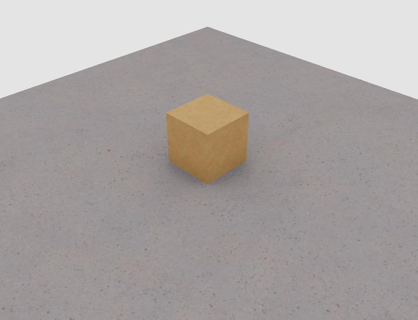

# Example - Bind MDL Material

This example demonstrates binding materials to objects.  It must be run inside
omniverse to pull from the rich set of available MDL materials.

The example should display a box with a cardboard texture and a floor with
a concrete texture.

## Instructions

1. Modify the path on line 3 of ``main.py`` to the path you cloned usd_scene_construction_utils
2. Launch [Omniverse Code](https://developer.nvidia.com/omniverse/code-app)
3. Open the script editor
4. Copy the code from ``main.py`` into the script editor
5. Run the script editor.

