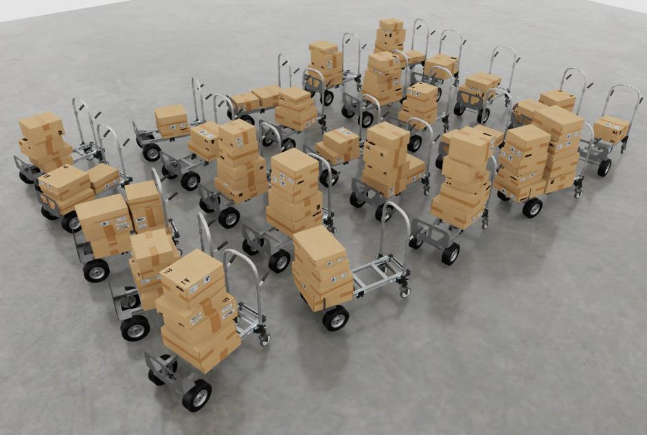

# Example - Hand Truck with Boxes

This example demonstrates creating a scene with structured randomization.
It creates a grid of hand trucks with boxes scattered on top.

e

## Instructions

1. Modify the path on line 3 of ``main.py`` to the path you cloned usd_scene_construction_utils
2. Launch [Omniverse Code](https://developer.nvidia.com/omniverse/code-app)
3. Open the script editor
4. Copy the code from ``main.py`` into the script editor
5. Run the script editor.

## Notes

This example defines a few functions.  Here are their descriptions.

| Function | Description |
|---|---|
| add_box_of_size | Adds a cardboard box of a given size, with randomly oriented labeling and tape. |
| add_random_box_stack | Adds a stack of cardboard boxes, sorted by cross-section size. Also adds some translation and angle jitter |
| add_random_box_stacks | Adds multiple random box stacks, aligned and stack on x-axis |
| add_hand_truck_with_boxes | Adds a hand truck, places the box stack at an offset so it appears as placed on the truck.  Makes any out-of-bounds boxes invisible. Wiggles the visible boxes in the area remaining on the hand truck. |

When developing this example, we started with just a simple function, and added complexity
iteratively by trying rendering, viewing, tweaking, repeat.

